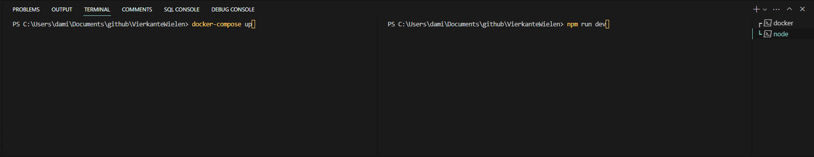

# How to Docker

### stap 1
installeer docker met dit linkje

https://www.docker.com/products/docker-desktop/

### stap 2
installeer wsl 

https://learn.microsoft.com/nl-nl/windows/wsl/install-manual#step-4---download-the-linux-kernel-update-package

# How to node

### stap 1
installeer node met dit linkje

https://nodejs.org/dist/v17.0.1/node-v17.0.1-x64.msi

# How to run the project

### stap 1 
zorg ervoor dat je 2 terminals open hebt staan zoals in het voorbeeld

### stap 2
zorg er nu voor dat de 2 commands in de terminal staan zoals in het voorbeeld en run eerst docker-compose up en dan pas npm run dev in de andere terminal

### uitzondering
als je de packages nog niet hebt geinstalleerd zorg er dan eerst voor dat je de volgende prompt uitvoert
> npm install

je mag geen andere locale databases aan hebben op port 3006 of 3000 sinds die al worden gebruikt door dit project